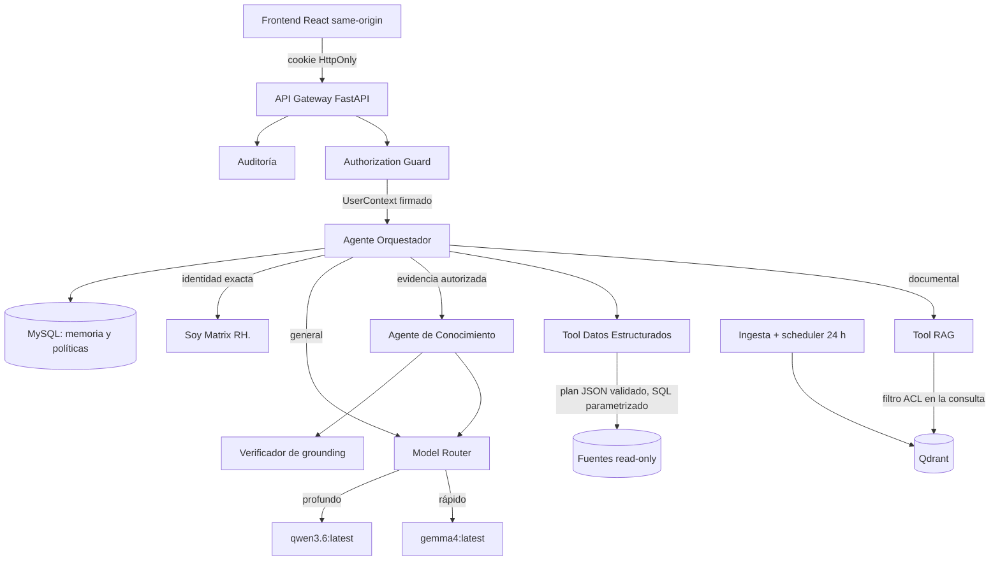

# Matrix RH

Plataforma agéntica interna de Recursos Humanos: chat con RAG sobre documentación
corporativa, acceso controlado a bases de datos estructuradas, memoria
conversacional y autorización por rol — todo ejecutándose **en local** con
Ollama, sin enviar un solo dato a un servicio externo.

> Creado por Aldo Garcia.
> Versión del paquete: **1.1.0**.

---

## 1. Qué es y qué no es

**Es**: un backend FastAPI + un frontend React que responden preguntas de RH,
resumen archivos adjuntos y muestran las fuentes que sostienen cada afirmación.
La recuperación se limita a los documentos que el usuario autenticado tiene
autorizados.

**No es**: una vía para completar documentación oficial con conocimiento general
del modelo. Si la evidencia no alcanza, lo dice. Si el usuario no tiene acceso,
lo dice sin revelar qué existe.

La diferencia entre lo que ve un administrador y lo que ve un usuario restringido
proviene **exclusivamente del backend**. Ambos usan la misma interfaz; no hay
opciones ocultas por rol.

---

## 2. Requisitos previos

| Requisito | Versión | Comprobación |
|---|---|---|
| Windows 10/11 | — | — |
| **Python 3.12 x64** | 3.12.x | `py -3.12 --version` |
| **uv** | 0.11.33 x64 | `uv --version` |
| **Ollama** con los tres modelos | — | `ollama list` |
| MySQL o MariaDB | 5.7+ / 10.4+ | WAMP lo provee en `127.0.0.1:3306` |
| Node.js (sólo para recompilar la UI o correr E2E) | 18+ | `node --version` |

Modelos de Ollama **obligatorios** (no se sustituyen):

```bash
ollama pull gemma4:latest
```
```bash
ollama pull qwen3.6:latest
```
```bash
ollama pull embeddinggemma:latest
```

Qdrant se ejecuta por defecto en modo **embebido persistente** (`QDRANT_MODE=embedded`),
por lo que no hace falta Docker. Si dispone de una instancia Qdrant dedicada,
ponga `QDRANT_MODE=server` y `QDRANT_URL`.

---

## 3. Instalación e inicialización (una sola vez)

Doble clic en:

```
INSTALAR_MATRIX_RH.bat
```

Es el **único** instalador: instala **e inicializa** el sistema en un solo doble
clic. Primero instala —de forma idempotente y en este orden: verifica Python
3.12 x64 → verifica Ollama y los tres modelos → comprueba `/api/embed` y que la
dimensión real sea **768** → prepara `.env` y directorios runtime → crea o
reutiliza `.venv` → instala el backend → comprueba que la base destino sea propia
o esté libre → reutiliza el frontend precompilado o lo compila → aplica
migraciones y seed de desarrollo → ejecuta preflight → indexa el conocimiento
inicial— y, al terminar con éxito, **arranca el backend, espera `/health` y
`/ready`, sirve la interfaz y abre el navegador**. Para arranques posteriores use
`INICIAR_MATRIX_RH.bat`.

Parámetros opcionales (se pasan al instalador): `-WithAutostart` registra el
arranque al iniciar sesión de Windows, `-SkipFrontend` no recompila la interfaz,
`-SkipIngest` omite la ingesta inicial.

Si prefiere la línea de comandos (sólo instalar, sin arrancar):

```bash
powershell -ExecutionPolicy Bypass -File windows\Install-MatrixRH.ps1
```

> **Base de datos.** Por defecto se usa `DATABASE_URL=mysql+pymysql://root:@127.0.0.1:3306/matrix_rh`.
> Si en su servidor ya existe una base con ese nombre, Matrix RH **no la usa**:
> el paso 6 del instalador elige el primer nombre libre (`matrix_rh_app`,
> `_app2`, …), lo escribe en `.env` y se lo dice. Su base queda intacta.
>
> Vale también para una base que exista pero esté **vacía**: Matrix RH sólo usa
> las bases que ha creado él. Si esa base es suya y quiere reutilizarla, póngalo
> por escrito con `MATRIX_ADOPT_EXISTING_DATABASE=true` en `.env`.

---

## 4. Arranque

Doble clic en:

```
INICIAR_MATRIX_RH.bat
```

Ejecuta el preflight, levanta el backend, espera a `/health` y `/ready`, sirve la
interfaz *same-origin* y abre el navegador en `http://127.0.0.1:8000`.

Para detenerlo:

```
DETENER_MATRIX_RH.bat
```

La guía corta de instalación, operación y diagnóstico está en
[`docs/OPERATOR_QUICKSTART.md`](docs/OPERATOR_QUICKSTART.md).

---

## 5. Usuarios de prueba

Mientras Microsoft Entra ID no esté conectado, Matrix RH usa un proveedor de
identidad local que **sólo funciona con `APP_ENV=development` o `test`**.

| Usuario | Contraseña | Rol | Acceso |
|---|---|---|---|
| `Matrix` | `Matrix RH` | `matrix_admin_test` | Categorías de negocio habilitadas para wildcard; no concede dominios restringidos nominales |
| `MatrixR1` | `Matrix RH` | `prestaciones_reader_test` | Únicamente `prestaciones` |

> ⚠️ **Estas son credenciales sintéticas conocidas de prueba, no secretos
> productivos.** Existen para validar el modelo de identidad y autorización antes
> de disponer de Entra ID. La contraseña **nunca** se guarda en claro: la base
> almacena exclusivamente un hash Argon2id. **Elimine o deshabilite estas cuentas
> antes de producción** — el arranque con `APP_ENV=production` ya falla si el
> proveedor local o el seed siguen habilitados.

---

## 6. Uso

1. Inicie sesión.
2. Para información de RH, pregunte en lenguaje natural: *"¿Cuántos días de
   vacaciones me corresponden con 5 años de antigüedad?"*. La respuesta se
   limita a documentación autorizada y muestra sus **fuentes**.
3. Para una consulta general fuera de RH, los modelos pueden explicar, idear o
   redactar con su conocimiento local. Esa ruta no se presenta como información
   interna y no fabrica citas corporativas.
4. Puede arrastrar un archivo (`.docx`, `.md`, `.pdf`, `.txt`, `.xlsx`, `.csv`) al
   chat. Espere a que aparezca como `indexed` y pida, por ejemplo, *«Resume el
   archivo adjunto y destaca sus puntos principales»*. El resumen muestra sus
   fuentes y se limita **sólo a esa conversación**: el adjunto no entra al corpus
   corporativo y nadie más puede verlo. Si hay varios adjuntos, el resumen cubre
   el contenido privado disponible en la conversación; use una conversación por
   archivo cuando necesite aislarlos.
5. «¿Quién eres?» responde exactamente «Soy Matrix RH.» sin depender de cuál de
   los dos modelos esté cargado.
6. Publicar conocimiento corporativo permanente requiere permiso administrativo
   y una categoría dentro del alcance efectivo del rol.

---

## 7. Añadir documentación corporativa

La documentación oficial se divide en ámbito general y repositorios
especializados:

```
data/knowledge/
├── general/
│   └── <tema>/
└── especializadas/
    └── <dominio>/
```

`general` corresponde al alcance base `HCM_EMP_BASICO_MX`. Cada dominio bajo
`especializadas` requiere su concesión `HCM_ADM_*` o `HCM_COORD_*`. Nómina
General y Nómina Confidencial se mantienen en dominios y grupos independientes.
Consulte la tabla exacta de rutas en
[`data/knowledge/README.md`](data/knowledge/README.md) y las reglas en
[`docs/DOCUMENTATION_GOVERNANCE.md`](docs/DOCUMENTATION_GOVERNANCE.md).

Las categorías **no son una lista cerrada**. Una carpeta nueva queda
**deny-by-default** y fuera del wildcard hasta que exista una regla explícita en
`config/authorization/categories.yaml` **y** una concesión de rol (que se
materializa con `scripts.load_entra_mapping`). **Ingerir un archivo no abre acceso
por sí solo:** si la categoría no está declarada y concedida, el modelo nunca la
recibe aunque esté indexada.

El procedimiento completo para un **dominio nuevo** (crear carpeta → declarar en
`categories.yaml` → conceder al rol → ingerir → verificar → probar) está en
[`docs/DOCUMENTATION_GOVERNANCE.md`](docs/DOCUMENTATION_GOVERNANCE.md),
sección «Publicar en un dominio nuevo».

Si tus archivos van a `general/`, no hay configuración extra. La reconciliación es
automática cada 24 h; para forzarla:

```bat
set "PYTHONPATH=%CD%\backend"
.venv\Scripts\python.exe -m scripts.bootstrap ingest
```

(ejecutar desde la raíz del proyecto; el instalador ya lo hace durante la primera
instalación).

---

## 8. Diagnóstico y validación

| Script | Qué hace | Modifica algo |
|---|---|---|
| `DIAGNOSTICO_MATRIX_RH.bat` | Revisa Python, venv, Ollama, modelos, embeddings, MySQL, Qdrant, frontend, backend, puertos, migraciones, usuarios de prueba, scheduler, Entra ID, conectores y logs | **No** |
| `windows\Validate-MatrixRH.ps1` | Preflight, migraciones, seed, ingesta, pruebas, seguridad, golden set del RAG, E2E, escenarios `Matrix`/`MatrixR1` y escaneo de secretos. Genera `reports/final-validation.json` | Sí (base de test) |

> La validación ya no tiene un `.bat` propio: se ejecuta directamente por
> PowerShell (misma lógica que antes).

Ejecución típica de la validación (con opciones útiles):

```bash
powershell -ExecutionPolicy Bypass -File windows\Validate-MatrixRH.ps1 -QuickRag -SkipE2E
```

La revisión offline del paquete 1.1.0 está aprobada, pero WAMP/MySQL, Qdrant,
Ollama y el E2E visual deben validarse en el equipo Windows destino. No considere
la instalación aceptada hasta que `Validate-MatrixRH.ps1` termine con código 0 y
`reports/final-validation.json` no tenga gates críticos abiertos. Consulte el
estado honesto en [`docs/FINAL_AUDIT.md`](docs/FINAL_AUDIT.md).

### Fuentes estructuradas por perfil corporativo

Una consulta requiere simultáneamente `structured.query`, una concesión
`StructuredSourcePermission` y una fuente habilitada con DSN read-only:

| Rol HCM | Fuentes concedidas |
|---|---|
| `hcm_adm_ia_matrix` | `rh_demo`, `postgres_analytics` |
| `hcm_adm_admpersonal` | `sap_hcm`, `oracle_hcm` |
| `hcm_coord_*` y demás roles HCM | ninguna |

Las fuentes externas se distribuyen deshabilitadas o sin DSN: una concesión no
equivale a una conexión validada.

---

## 9. Arquitectura en una página



Detalle completo en [`docs/ARCHITECTURE.md`](docs/ARCHITECTURE.md).

---

## 10. Estructura del repositorio

```yaml
matrix-rh:
  backend:                         # FastAPI + Python 3.12 (gestionado con uv)
    app:                           # Código de la aplicación
      api:                         # Gateway HTTP
        routes:                    #   admin, auth, chat, conversations, health
        deps.py:                   #   inyección de dependencias
        middleware.py:             #   cabeceras de seguridad, contexto de request
        schemas.py:                #   contratos de entrada/salida
      auth:                        # Identidad y sesiones
        provider.py:               #   contrato de proveedor de identidad
        entra_provider.py:         #   Microsoft Entra ID / OIDC (preparado)
        local_provider.py:         #   proveedor local (sólo dev/test)
        passwords.py:              #   hashing Argon2id (nunca contraseñas en claro)
        sessions.py:               #   sesiones con cookie HttpOnly (patrón BFF);
                                   #   el token nunca llega al navegador
      authorization:              # RBAC aplicado ANTES de RAG/SQL/prompt
        categories.py:             #   alcance de categorías y wildcard (deny-by-default)
        context.py:                #   UserContext firmado (roles + concesiones)
        policy.py:                 #   evaluación de AuthorizationPolicy
        # Puertas: CategoryPermission (RAG), StructuredSourcePermission (SQL)
      agents:                      # Capa agéntica
        orchestrator.py:           #   enruta documental / estructurado / general
        query_planner.py:          #   plan de consulta
        knowledge_agent.py:        #   respuesta con evidencia autorizada
        prompts.py:                #   plantillas de prompt
      rag:                         # Recuperación aumentada
        chunking.py:               #   segmentación de documentos
        embedding_prompts.py:      #   prompts de embedding
        retriever.py:              #   recuperación con filtro ACL en la consulta
        grounding.py:              #   verificador de grounding / anti-alucinación
        vector_store.py:           #   integración con Qdrant
        schemas.py:                #   contratos del RAG
      structured_data:            # Acceso a datos estructurados read-only
        schemas.py:                #   plan de consulta (el LLM NO escribe SQL)
        validator.py:              #   valida el plan: allowlist de entidades y
                                   #   columnas por fuente + concesión de rol
        compiler.py:               #   plan validado -> SQL parametrizado (valores
                                   #   como bind params) + re-verificación por AST
        adapters.py:               #   ReadOnlySourceAdapter por motor:
                                   #   MySQL/MariaDB, PostgreSQL, SQL Server, Oracle
        sources.py:                #   catálogo; el DSN read-only vive en una env var,
                                   #   nunca se persiste ni se registra
        tool.py:                   #   herramienta expuesta al orquestador
      ingestion:                   # Ingesta de conocimiento
        loaders.py:                #   carga de .docx/.md/.pdf/.txt/.xlsx/.csv
        reconciler.py:             #   reconciliación del corpus
        service.py:                #   orquestación de ingesta
      llm:                         # Capa de modelos (Ollama, local)
        model_policy.py:           #   router de los dos modelos
        ollama_client.py:          #   cliente Ollama
      security:                    # Controles de seguridad transversales
        prompt_guard.py:           #   sanea texto no confiable (docs/mensajes) y
                                   #   neutraliza marcadores de prompt injection
        rate_limit.py:             #   rate limiting por ventana deslizante de 60 s
        upload_guard.py:           #   allowlist de extensiones, magic bytes,
                                   #   límites anti-zip-bomb, nombre interno UUID
      memory:                      # Memoria conversacional
        service.py:
      audit:                       # Auditoría de eventos
        service.py:
      jobs:                        # Tareas programadas
        scheduler.py:              #   reconciliación automática cada 24 h
      database:                    # Persistencia interna (MySQL/MariaDB)
        engine.py:                 #   engine con pool + pool_pre_ping + recycle
                                   #   (resiste el "MySQL server has gone away")
        migrator.py:               #   aplica migraciones y registra schema_migrations
        models.py:                 #   modelos ORM SQLAlchemy. Dominios de tablas:
          # Identidad:  users, local_credentials, identity_links
          # RBAC:       roles, permissions, role_permissions, user_roles,
          #             entra_group_role_mappings, authorization_policies
          # Alcance:    category_permissions, structured_source_permissions
          # Sesiones:   sessions, oidc_login_states
          # Conversación: conversations, conversation_messages,
          #             conversation_summaries        (memoria)
          # Documental: documents, document_versions, document_access_policies
          # Ingesta:    ingestion_jobs, job_locks
          # Estructurado: structured_data_sources, structured_source_policies
          # Auditoría:  audit_events
          # Esquema:    schema_migrations
      common:                      # Utilidades transversales
        errors.py:                 #   errores del dominio
        ids.py:                    #   generación de identificadores
        logging.py:                #   redacción en el formatter
        redaction.py:              #   reglas de redacción
      config:                      # Ajustes de la aplicación
        settings.py:               #   configuración tipada desde .env
      main.py:                     # Punto de entrada FastAPI
    migrations:                    # Migraciones SQL versionadas e idempotentes
      0001_initial_schema.sql:     #   esquema inicial
      0002_widen_audit_status.sql: #   amplía el estado de auditoría
      0003_message_sequence.sql:   #   secuencia de mensajes de conversación
    seeds:                         # Semillas reproducibles (identidad de prueba)
    scripts:                       # Preflight, bootstrap, quality gate, rag_eval,
                                   #   secrets_scan, verify_supply_chain, verify_headers
    tests:                         # Suite de pruebas del backend
      unit:                        #   pruebas unitarias
      integration:                 #   pruebas de integración
      security:                    #   superficie de ataque y contratos de runtime
      rag_eval:                    #   golden_set.yaml del RAG
    Dockerfile:                    # Imagen del backend
    pyproject.toml:                # Dependencias y metadatos (uv)

  frontend:                        # React + TypeScript + Vite (same-origin)
    src:
      pages:                       #   ChatPage, LoginPage
      components:                  #   Composer, MessageList, Sidebar, TracePanel…
      security:                    #   Markdown seguro
      services:                    #   cliente de API
      App.tsx:                     #   raíz de la aplicación
      main.tsx:                    #   bootstrap del cliente
    tests:                         # Vitest (componentes) + Playwright (E2E)
      e2e:                         #   auth, authorization, documents-memory, operations
    dist:                          # Build precompilada servida por el backend
    package.json:                  # Dependencias (npm; ver §12-bis)
    package-lock.json:             # lockfile congelado para instalación reproducible

  config:                          # Configuración de negocio versionada
    authorization:                 # Políticas fuera de código
      categories.yaml:             #   reglas de categorías (deny-by-default)
      entra-role-mapping.yaml:     #   grupo Entra -> rol HCM
    data_sources:                  # Fuentes estructuradas externas
      sources.yaml:                #   motor, entidades y columnas permitidas;
                                   #   referencia a la env var del DSN (no el DSN)
    supply_chain_denylist.yaml:    #   lista de bloqueo de la cadena de suministro (registro npm)

  data:                            # Datos del sistema
    knowledge:                     #   corpus corporativo indexable
      general:                     #     alcance base HCM_EMP_BASICO_MX
      especializadas:              #     dominios con concesión HCM_ADM_*/HCM_COORD_*
    synthetic_test_data:           #   datos sintéticos para pruebas

  infrastructure:                  # Infraestructura de despliegue
    database:                      # Provisión de la base interna
      init:                        #   01-create-database.sql (creación inicial)
    nginx:                         #   matrixrh.conf (reverse proxy same-origin)
    qdrant:                        #   configuración del vector store (ACL en la query)

  docs:                            # Documentación técnica y de seguridad
    integrations:                  #   Entra ID, conectores de base de datos

  reports:                         # Evidencia de pruebas, seguridad y revisiones

  windows:                         # Scripts PowerShell que invocan los .bat
  scripts:                         # Lanzador multiplataforma (matrixrh.sh)

  # Lanzadores en la raíz (doble clic en Windows):
  INSTALAR_MATRIX_RH.bat:          # ÚNICO instalador: instala E inicializa.
                                   #   Instala (Install-MatrixRH.ps1) y, al
                                   #   terminar, arranca el sistema y abre el
                                   #   navegador. Un solo doble clic deja Matrix
                                   #   RH instalado y en ejecución.
                                   #   Opcional: -WithAutostart / -SkipFrontend /
                                   #   -SkipIngest se pasan al instalador.
  INICIAR_MATRIX_RH.bat:           # arranque en usos posteriores
  DETENER_MATRIX_RH.bat:           # parada del sistema (sólo procesos propios)
  DIAGNOSTICO_MATRIX_RH.bat:       # diagnóstico de sólo lectura (no modifica nada)
  # (La validación y el autoarranque ya no tienen .bat propio; se ejecutan con
  #  windows\Validate-MatrixRH.ps1 y windows\Install-Autostart.ps1.)

  docker-compose.yml:              # Despliegue contenerizado ALTERNATIVO al
                                   #   flujo Windows/WAMP. Orquesta la pila en
                                   #   staging/producción tipo servidor Linux:
    # services:
    #   mysql   -> MySQL 8.4; carga infrastructure/database/init; volumen
    #              persistente; healthcheck con mysqladmin ping. Red interna.
    #   qdrant  -> Qdrant v1.12.4 en modo server (QDRANT_MODE=server) con API key;
    #              storage persistente. Red interna.
    #   backend -> imagen desde backend/Dockerfile; espera a mysql sano; habla
    #              con Ollama del HOST vía host.docker.internal (los modelos NO se
    #              contenerizan: pesan decenas de GB y usan la GPU del host).
    #   nginx   -> ÚNICO servicio expuesto (80/443); reverse proxy same-origin.
    # networks: red bridge interna 'matrixrh' (mysql/qdrant/backend no se exponen).
    # volumes:  mysql_data, qdrant_data, backend_var (persistencia).
    # Secretos (MYSQL_PASSWORD, APP_SECRET_KEY, QDRANT_API_KEY…) llegan del entorno
    # o del gestor de secretos, nunca del repositorio. El conocimiento se monta
    # de sólo lectura: el contenedor lo indexa, no lo edita.
```

Cada carpeta propia versionada tiene su propio `README.md`.

---

## 11. Documentación

| Documento | Contenido |
|---|---|
| [`docs/ARCHITECTURE.md`](docs/ARCHITECTURE.md) | Componentes runtime y decisiones |
| [`docs/AI_DESIGN.md`](docs/AI_DESIGN.md) | Agentes, política de los dos modelos, anti-alucinación |
| [`docs/RAG_DESIGN.md`](docs/RAG_DESIGN.md) | Parámetros del RAG y dónde vive cada uno en el código |
| [`docs/DATA_MODEL.md`](docs/DATA_MODEL.md) | Modelo de datos interno |
| [`docs/AUTHENTICATION_AUTHORIZATION.md`](docs/AUTHENTICATION_AUTHORIZATION.md) | Identidad, sesiones, RBAC y matriz de permisos |
| [`docs/ACCESS_PROFILES.md`](docs/ACCESS_PROFILES.md) | Regla acumulativa de grupos HCM y segregación de Nómina |
| [`docs/DOCUMENTATION_GOVERNANCE.md`](docs/DOCUMENTATION_GOVERNANCE.md) | Gobierno de `general`, `especializadas` y adjuntos privados |
| [`docs/OPERATOR_QUICKSTART.md`](docs/OPERATOR_QUICKSTART.md) | Instalación, arranque y diagnóstico en Windows |
| [`docs/SECURITY.md`](docs/SECURITY.md) | Controles de seguridad |
| [`docs/THREAT_MODEL.md`](docs/THREAT_MODEL.md) | Modelo de amenazas |
| [`docs/TESTING.md`](docs/TESTING.md) | Estrategia y ejecución de pruebas |
| [`docs/E2E.md`](docs/E2E.md) | Flujos críticos end-to-end |
| [`docs/DEPLOYMENT.md`](docs/DEPLOYMENT.md) | Despliegue y contenerización |
| [`docs/RUNBOOK.md`](docs/RUNBOOK.md) | Operación diaria |
| [`docs/TROUBLESHOOTING.md`](docs/TROUBLESHOOTING.md) | Errores comunes y recuperación |
| [`docs/EXTERNAL_DEPENDENCIES_STATUS.md`](docs/EXTERNAL_DEPENDENCIES_STATUS.md) | Estado real de cada integración externa |
| [`docs/integrations/ENTRA_ID_SETUP.md`](docs/integrations/ENTRA_ID_SETUP.md) | Activar Microsoft Entra ID paso a paso |
| [`docs/REQUIREMENTS_TRACEABILITY.md`](docs/REQUIREMENTS_TRACEABILITY.md) | Requisito → componente → prueba → evidencia |
| [`docs/FINAL_AUDIT.md`](docs/FINAL_AUDIT.md) | Auditoría final |

---

## 12. Estado de las integraciones externas

| Integración | Estado del paquete 1.1.0 |
|---|---|
| Ollama (`gemma4`, `qwen3.6`, `embeddinggemma`) | requerida; validar localmente con instalador/preflight |
| MySQL/MariaDB interna | requerida; validar migraciones en WAMP destino |
| Qdrant (modo embebido) | requerido; validar colecciones y RAG en destino |
| Microsoft Entra ID | `PREPARED_NOT_CONNECTED` |
| SQL Server / Oracle / PostgreSQL externos | `PREPARED_NOT_CONNECTED` |

No se hereda el estado live de una versión anterior. `PREPARED_NOT_CONNECTED`
significa que el adapter existe, valida su
configuración, tiene health check y pruebas de contrato, pero **no** se ha
realizado una conexión real. Ver [`docs/EXTERNAL_DEPENDENCIES_STATUS.md`](docs/EXTERNAL_DEPENDENCIES_STATUS.md).

---

## 12-bis. Cadena de suministro del frontend

La instalacion operativa usa **npm**, incluido con Node. **Nunca ejecute
`npm install` sin banderas.** Use:

```bash
npm ci --ignore-scripts
```

Los gusanos del ecosistema npm (el registro es común a npm y pnpm) se propagan
ejecutando `preinstall`/`install`/`postinstall` en el equipo que instala: roban
credenciales del entorno y republican paquetes. `--ignore-scripts` impide que
**su código se ejecute** aunque un paquete comprometido entre al árbol, y
`npm ci` instala exactamente lo que fija `package-lock.json` (falla si
está desincronizado, no resuelve rangos). `frontend/.npmrc` ya fuerza
`ignore-scripts=true`; el instalador y el Dockerfile repiten la bandera en la
línea de comandos y no tienen fallback a una instalación sin fijar.

> **Nota de seguridad.** Cambiar de gestor no elimina el riesgo por sí solo:
> La defensa real es `ignore-scripts` + lockfile congelado + la verificación de
> abajo. Docker, instaladores y gates usan el mismo `package-lock.json`.

Verificación del árbol instalado (lista de bloqueo, scripts, indicadores de
compromiso y reproducibilidad):

```bat
set "PYTHONPATH=%CD%\backend"
.venv\Scripts\python.exe -m scripts.verify_supply_chain
```

Se ejecuta en cada arranque (preflight), en el instalador, en el quality gate y
en la validación. La lista de paquetes comprometidos vive en
`config/supply_chain_denylist.yaml` y se actualiza cuando se publica un
incidente. Detalle en [`docs/SECURITY.md`](docs/SECURITY.md) §13.

---

## 13. Seguridad en 10 líneas

- La autorización se aplica **antes** de RAG, **antes** del SQL y **antes** de
  construir el prompt. El modelo nunca ve lo que el usuario no puede ver.
- El filtro de categorías viaja **dentro** de la consulta a Qdrant, nunca como
  filtrado posterior.
- El LLM **no** genera SQL: produce un plan JSON validado que se compila a SQL
  parametrizado y se re-verifica por AST.
- Toda cita se comprueba contra la evidencia recuperada; una fuente inventada
  invalida la respuesta.
- Los tokens nunca llegan al navegador: patrón BFF con cookie `HttpOnly`.
- Ningún secreto en el repositorio; sólo `.env.example` con valores ficticios.
- Los logs se redactan en el *formatter*, no en el llamador.
- Las contraseñas locales usan Argon2id.
- Cargas: allowlist de extensiones, magic bytes, límites anti-zip-bomb, nombre
  interno UUID.
- Ver [`SECURITY.md`](SECURITY.md) para reportar una vulnerabilidad.

---

## 14. Licencia y autoría

Proyecto interno. Creado por Aldo Garcia.
